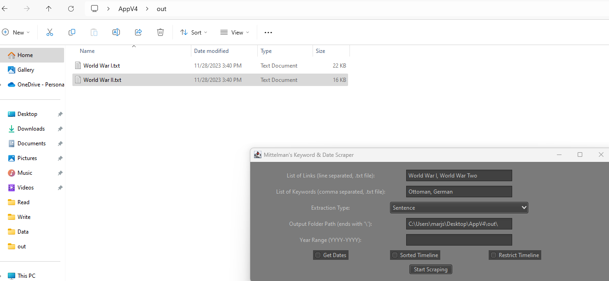

# MittelmanResearchScraper

## Description

The goal of this app is to expedite the research process, especially building of timelines for series of events with the date scraping feature. Users should be able to collect Wikipedia links that have relevance to what they are researching and when they have all of their links, instead of spending hours reading each page they can use this tool to look for specific keywords in all of the documents at once. Also this tool looks at every time a date is uttered in a sentence or paragraph and based on the first date it sees in each string, it will order each string.

## Table of Contents

- [Installation](#installation)
- [Uses](#uses)

## Installation
1. Either install the latest version executable file in /App
2. attempt to run this file (if it doesn't work try installing Java 11 and remove conflicting versions)
3. have an internet connection
4. Use the app, check uses below

## Uses (User Manual)

<b>List of Links</b> (textbox input): Either input the absolute file path of a text (.txt) file that contains a list of Wikipedia article titles (each element being on a new line). Or input a few Wikipedia article titles into this textbox separated by commas. Each one of these pages will have its (any 
 tag element) paragraphs or sentences (specified) scraped for any of keywords or date information (toggled).

<b>List of Keywords</b> (textbox input): Either input the absolute file path of a text (.txt) file that contains a list of keywords to search for in the Wikipedia articles (each element being separated by commas). Or input a few keywords into this textbox separated by commas.

<b>Extraction Type</b> (dropdown): If a keyword or date item (if Get Dates is toggled) is seen in a paragraph and extraction type is paragraph, write this paragraph to file. If extraction type is sentences, go into the paragraph and find the sentences where the keywords or dates are present and then write these sentences to file.

<b>Output Folder Path</b> (textbox input): Must be an absolute file path to the desired folder where all of the text files should be written to (make sure to end the path with a "\\" character).

<b>Year Range</b> (textbox input): This only affects the "CompiledSortedTimeline.txt" file (each specific article file will ignore these bounds). When empty, doesn't limit the timeline years range. When one 4-digit year is in the text box, ("1900" or "5000 BC") it assumes that input is the lower bound and the timeline gets any years (inclusive) ahead of that input year. When specific range ("2500 BC-1000 BC" or "1900-2000" or "5000 BC - 1500") the "CompiledSortedTimeline.txt" will only retain string within that year range. Bad arguments include any year bound being a non-4-digit year, potentially any string not formatted likeso: "year BC-year BC" (with or without BC).

<b>Get Dates</b> (toggle): If this is selected, each file (named by article title on wiki) will also contain any date information seen in the article (including 4 digit years, month names, weekday names).

<b>Sorted Timeline</b> (toggle): ONLY WORKS IF GET DATES IS ALSO TOGGLED. Compiles and orders (ascending) strings (paragraph or sentence) that contain a 4-digit year (doesn't consider BC at all, also may scrape 4 digit quantities).

<b>Restrict Timeline</b> (toggle): ONLY WORKS/DOES WHAT WE WANT IF SORTED TIMELINE IS ALSO TOGGLED. Excludes any Strings from the "CompiledSortedTimeline.txt" file that contain invalid years and also considers "BC" in the ordering. Valid strings are those that contain a year that either have the word "in" or "since" within 2 (inclusive) words or "on" within 4 words (inclusive) to the left of the year. Or any type of BC or AD string within (inclusive) 2 words to the right of the year (TODO: add "CE" to the validity).
